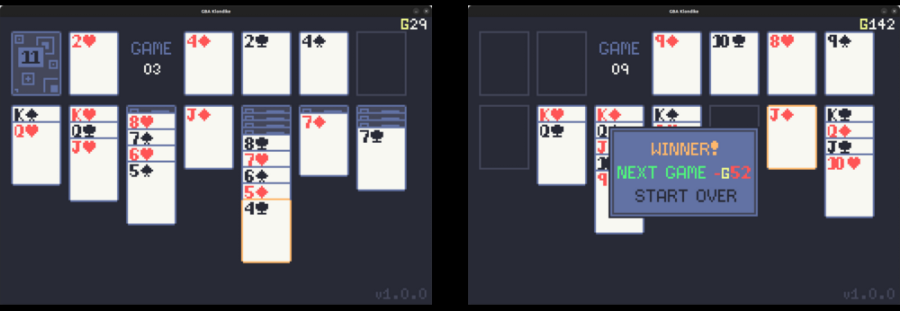

# GBA Klondike Solitaire

This is a [Klondike Solitaire](https://en.wikipedia.org/wiki/Klondike_(solitaire)) implementation using Pygame, with the target dimensions of a GBA screen (240x160). It's designed for an [8BitDo SN30](https://www.8bitdo.com/sn30-pro-g-classic-or-sn30-pro-sn/) gamepad.

It uses Vegas rules (one-card turn, single pass) and "currency" -- You start with G100, buy in to each game with G52, and every card on a foundation pays G5. You can go negative, but must have at least G1 to start the next round. There is no undo feature. The goal is to see how many games you can complete or how high you can get your earnings. This info is not saved anywhere.

For me, the eventual goal here is to rewrite this game in C with the Game Boy SDK and put it on an actual cart.

### Controls
- DPAD: Navigate
- A: Select/place
- B: Deselect/cancel
- X: Select all face-up cards in the current stack
- L1/L2: Draw a card
- R1/R2: Move focused card to foundation
- START: Show/hide menu

### #TODO
- Add the ability to save and display high scores (most games & best earnings)
- Add a menu to modify controls (and save these updates)
